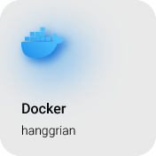
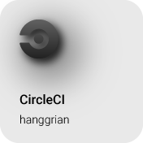
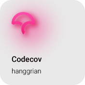
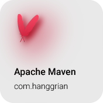
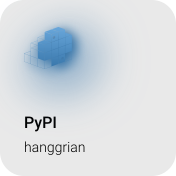
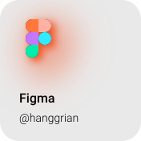
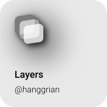

<table>
  <thead>
    <tr>
      <th>
        <a href="https://hub.docker.com/u/hanggrian/">
          <picture>
            <source
              media="(prefers-color-scheme: dark)"
              srcset="images/card-docker-dark.png"/>
            
          </picture>
        </a>
      </th>
      <th>
        <a href="https://circleci.com/gh/hanggrian/">
          <picture>
            <source
              media="(prefers-color-scheme: dark)"
              srcset="images/card-circleci-dark.png"/>
            
          </picture>
        </a>
      </th>
      <th>
        <a href="https://codecov.io/gh/hanggrian/">
          <picture>
            <source
              media="(prefers-color-scheme: dark)"
              srcset="images/card-codecov-dark.png"/>
            
          </picture>
        </a>
      </th>
      <th>
        <a href="https://repo1.maven.org/maven2/com/hanggrian/">
          <picture>
            <source
              media="(prefers-color-scheme: dark)"
              srcset="images/card-apachemaven-dark.png"/>
            
          </picture>
        </a>
      </th>
    </tr>
  </thead>
  <tbody>
    <tr>
      <td>
        <a href="https://plugins.gradle.org/u/hanggrian/">
          <picture>
            <source
              media="(prefers-color-scheme: dark)"
              srcset="images/card-gradle-dark.svg"/>
            
          </picture>
        </a>
      </td>
      <td colspan="2">
        <a href="https://hanggrian.github.io/">
          <picture>
            <source
              media="(prefers-color-scheme: dark)"
              srcset="images/card-githubpages-dark.svg"/>
            
          </picture>
        </a>
      </td>
      <td>
        <a href="https://pypi.org/u/hanggrian/">
          <picture>
            <source
              media="(prefers-color-scheme: dark)"
              srcset="images/card-pypi-dark.svg"/>
            
          </picture>
        </a>
      </td>
    </tr>
    <tr>
      <td>
        <a href="https://figma.com/@hanggrian">
          <picture>
            <source
              media="(prefers-color-scheme: dark)"
              srcset="images/card-figma-dark.svg"/>
            
          </picture>
        </a>
      </td>
      <td>
        <a href="https://layers.to/hanggrian">
          <picture>
            <source
              media="(prefers-color-scheme: dark)"
              srcset="images/card-layers-dark.svg"/>
            
          </picture>
        </a>
      </td>
      <td>
        <a href="https://pinterest.com/hanggrian/">
          <picture>
            <source
              media="(prefers-color-scheme: dark)"
              srcset="images/card-pinterest-dark.svg"/>
            
          </picture>
        </a>
      </td>
      <td>
        <a href="https://linkedin.com/in/hanggrian/">
          <picture>
            <source
              media="(prefers-color-scheme: dark)"
              srcset="images/card-linkedin-dark.svg"/>
            
          </picture>
        </a>
      </td>
    </tr>
  </tbody>
</table>

# Hi, I'm Hendra 

> [!NOTE]
  Currently studying Computer Science at *Illinois Institute of Technology.*

I am a Java and Python developer who loves cross-platform tools and development.
I believe in open source; some of the best software is made by the community
at no cost.

- 
  I am a member of the cult of Arch Linux
- <picture>
    <source
      media="(prefers-color-scheme: dark)"
      srcset="https://cdn.simpleicons.org/apple/white"/>
    
  </picture>
  I design graphics and user interfaces for macOS
- 
  I play video games on Windows
