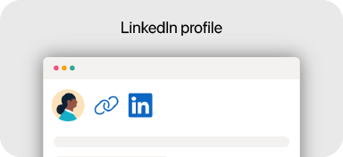

<!-- For some unknown reason, images in the last row of the table have to be in
  PNG format if the rest of the images are in SVG format. -->

<table>
  <thead>
    <tr>
      <th colspan="6">
        <picture>
          <source
            media="(prefers-color-scheme: dark)"
            srcset="images/banner1-dark.svg"/>
          
        </picture>
      </th>
    </tr>
  </thead>
  <tbody>
    <tr>
      <td colspan="2">
        <a href="https://codecov.io/gh/hanggrian/">
          <picture>
            <source
              media="(prefers-color-scheme: dark)"
              srcset="images/card-codecov-dark.svg"/>
            
          </picture>
        </a>
      </td>
      <td>
        <a href="https://circleci.com/gh/hanggrian/">
          <picture>
            <source
              media="(prefers-color-scheme: dark)"
              srcset="images/card-circleci-dark.svg"/>
            
          </picture>
        </a>
      </td>
      <td>
        <a href="https://hub.docker.com/u/hanggrian/">
          <picture>
            <source
              media="(prefers-color-scheme: dark)"
              srcset="images/card-docker-dark.svg"/>
            
          </picture>
        </a>
      </td>
      <td rowspan="2">
        <a href="https://figma.com/@hanggrian/">
          <picture>
            <source
              media="(prefers-color-scheme: dark)"
              srcset="images/card-figma-dark.svg"/>
            
          </picture>
        </a>
      </td>
      <td rowspan="2">
        <a href="https://hanggrian.super.site/">
          <picture>
            <source
              media="(prefers-color-scheme: dark)"
              srcset="images/card-notion-dark.svg"/>
            
          </picture>
        </a>
      </td>
    </tr>
    <tr>
      <td>
        <a href="https://steamcommunity.com/id/hanggrian/">
          <picture>
            <source
              media="(prefers-color-scheme: dark)"
              srcset="images/card-steam-dark.svg"/>
            
          </picture>
        </a>
      </td>
      <td>
        <a href="http://discord.com/users/280390548429340672/">
          <picture>
            <source
              media="(prefers-color-scheme: dark)"
              srcset="images/card-discord-dark.svg"/>
            
          </picture>
        </a>
      </td>
      <td rowspan="2" colspan="2">
        <a href="https://hanggrian.github.io/">
          <picture>
            <source
              media="(prefers-color-scheme: dark)"
              srcset="images/card-githubpages-dark.svg"/>
            
          </picture>
        </a>
      </td>
    </tr>
    <tr>
      <td colspan="2">
        <a href="https://pinterest.com/hanggrian/">
          <picture>
            <source
              media="(prefers-color-scheme: dark)"
              srcset="images/card-pinterest-dark.svg"/>
            
          </picture>
        </a>
      </td>
      <td>
        <a href="mailto:hanggrian@proton.me">
          <picture>
            <source
              media="(prefers-color-scheme: dark)"
              srcset="images/card-protonmail-dark.svg"/>
            
          </picture>
        </a>
      </td>
      <td>
        <a href="https://pypi.org/u/hanggrian/">
          <picture>
            <source
              media="(prefers-color-scheme: dark)"
              srcset="images/card-pypi-dark.svg"/>
            
          </picture>
        </a>
      </td>
    </tr>
    <tr>
      <td colspan="2">
        <a href="https://layers.to/hanggrian/">
          <picture>
            <source
              media="(prefers-color-scheme: dark)"
              srcset="images/card-layers-dark.png"/>
            
          </picture>
        </a>
      </td>
      <td colspan="2">
        <a href="https://linkedin.com/in/hanggrian/">
          <picture>
            <source
              media="(prefers-color-scheme: dark)"
              srcset="images/card-linkedin-dark.png"/>
            
          </picture>
        </a>
      </td>
      <td>
        <a href="https://central.sonatype.com/namespace/com.hanggrian/">
          <picture>
            <source
              media="(prefers-color-scheme: dark)"
              srcset="images/card-sonatype-dark.png"/>
            
          </picture>
        </a>
      </td>
      <td>
        <a href="https://plugins.gradle.org/u/hanggrian/">
          <picture>
            <source
              media="(prefers-color-scheme: dark)"
              srcset="images/card-gradle-dark.png"/>
            
          </picture>
        </a>
      </td>
    </tr>
  </tbody>
</table>

<table>
  <thead>
    <tr>
      <th colspan="4">
        <picture>
          <source
            media="(prefers-color-scheme: dark)"
            srcset="images/banner2-dark.svg"/>
          
        </picture>
      </th>
    </tr>
  </thead>
  <tbody>
    <tr>
      <td>
        <picture>
          <source
            media="(prefers-color-scheme: dark)"
            srcset="images/grid-description1-dark.png"/>
          
        </picture>
      </td>
      <td>
        <picture>
          <source
            media="(prefers-color-scheme: dark)"
            srcset="images/grid-description2-dark.png"/>
          
        </picture>
      </td>
      <td>
        <picture>
          <source
            media="(prefers-color-scheme: dark)"
            srcset="images/grid-description3-dark.png"/>
          
        </picture>
      </td>
      <td>
        <picture>
          <source
            media="(prefers-color-scheme: dark)"
            srcset="images/grid-description4-dark.png"/>
          
        </picture>
      </td>
    </tr>
    <tr>
      <td colspan="6" align="center">
         
         
        <!-- GitHub embeds the animated SVG url to image, mask it with a
          self-targeting link. -->
        Thanks for stopping by.&emsp;
      </td>
    </tr>
  </tbody>
</table>
